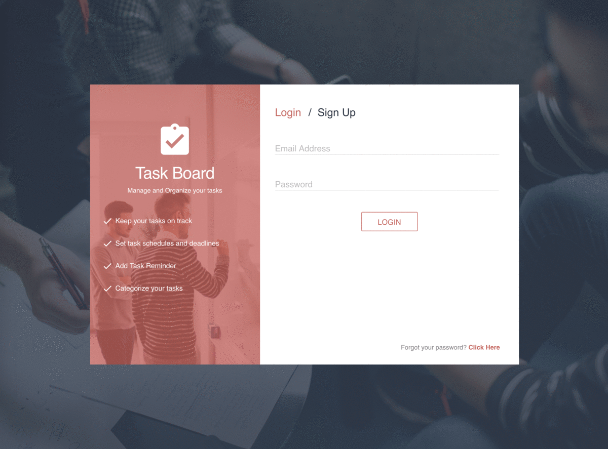

# task-management-system
An application that helps you manage your tasks.




#### Main dev tools used:
`Angular 4` `Angular CLI` `NodeJS` `ExpressJS` `KnexJS` `MySQL` `Typescript` `ES6` `Passport-Local`


#### How to run
```
* Start your MySQL Server based on your machine's start command. 

$ npm run build          - Installs all node modules from backend & frontend
$ npm run knex:latest    - Runs all migration scripts
$ npm run start          - Runs angular and express


Additional Info

$ npm run knex:rollback  - Rolls back the migration scripts
$ npm run express-start  - Runs express
$ npm run ng-start       - Runs angular
```